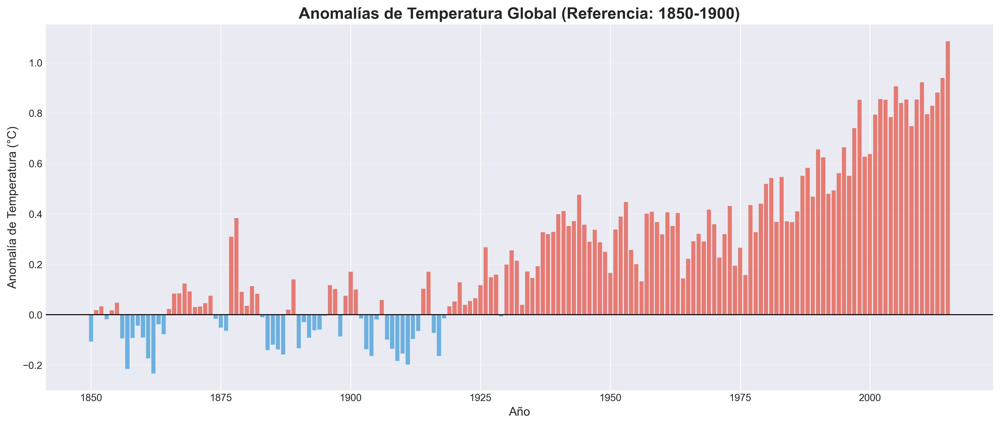
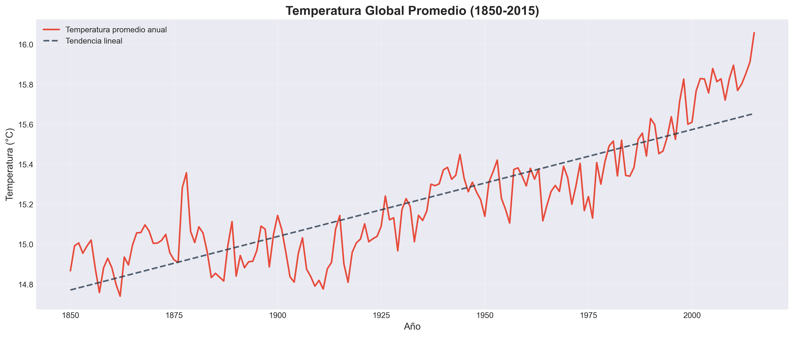
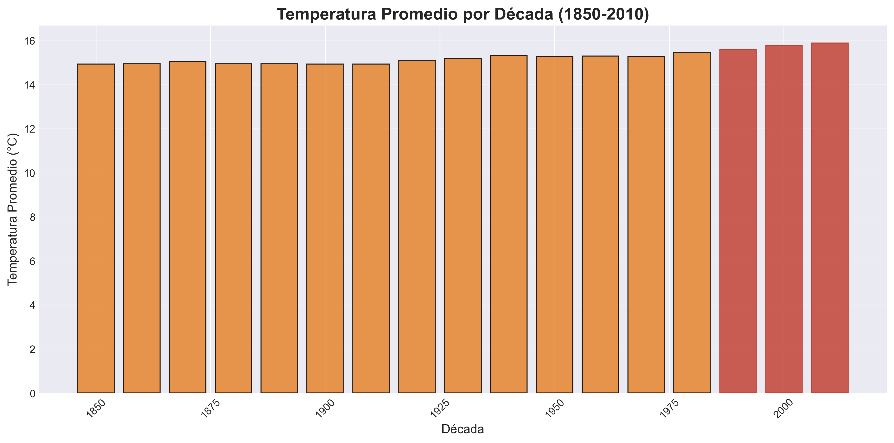

# 🌍 Análisis de Temperatura Global y Cambio Climático (1850-2015)

**Autor:** Oscar Mauricio Montenegro  
**LinkedIn:** [linkedin.com/in/oscar-mauricio-montenegro](https://linkedin.com/in/oscar-mauricio-montenegro/)  
**Fecha:** Abril 2026  

---

## 📊 Descripción del Proyecto

Análisis exploratorio de datos de temperatura global utilizando el dataset de Berkeley Earth Surface Temperature. Este proyecto examina las tendencias de calentamiento global desde 1850 hasta 2015, cuantifica la aceleración del cambio climático, e identifica los años y décadas más cálidos en el registro histórico.

**Herramientas:** Python, Pandas, Matplotlib, Seaborn, Jupyter Notebook

---

## 🔍 Hallazgos Clave

### 1. Tendencia de Calentamiento Global
- **Aumento total (1850-2015):** +0.88°C
- **Tasa promedio:** +0.0054°C por año
- **Temperatura base (1850-1900):** 14.97°C
- **Temperatura actual (2015):** 16.06°C
- **Anomalía actual:** +1.08°C

### 2. Aceleración del Calentamiento
El calentamiento global se ha **acelerado 3.8x** en décadas recientes:
- **1901-1950 vs 1850-1900:** +0.12°C
- **2001-2015 vs 1951-2000:** +0.45°C

### 3. Años Más Calientes (Top 5)
1. **2015:** 16.06°C
2. **2014:** 15.91°C
3. **2010:** 15.90°C
4. **2005:** 15.88°C
5. **2013:** 15.85°C

> 💡 **Insight:** Los 5 años más calientes registrados ocurrieron en la década de 2010.

### 4. Década Más Caliente
**2010s:** 15.88°C promedio - la década más cálida en 165 años de registros.

---

## 📈 Visualizaciones

### Anomalías de Temperatura (1850-2015)


**Interpretación:** Las barras azules representan años más fríos que el periodo base (1850-1900), mientras que las rojas muestran años más cálidos. La transición de azul a rojo después de 1970 evidencia la aceleración del calentamiento global.

### Tendencia de Temperatura Global


**Interpretación:** La línea de tendencia muestra un incremento sostenido de +0.88°C en 165 años, con aceleración notable después de 1980.

### Calentamiento por Década


**Interpretación:** Cada década desde 1980 ha sido más cálida que la anterior, con las tres últimas décadas (1990s, 2000s, 2010s) marcadas en rojo intenso.

### Aceleración del Calentamiento por Periodos


**Interpretación:** El aumento de temperatura se ha triplicado en velocidad comparando el periodo 2001-2015 con 1901-1950.

---

## 🗂️ Estructura del Proyecto

climate-temperature-analysis/
├── analysis.ipynb              # Jupyter Notebook con análisis completo
├── data/
│   └── GlobalTemperatures.csv  # Dataset de Berkeley Earth
├── outputs/
│   ├── temperature_trend.png
│   ├── temperature_anomaly.png
│   ├── temperature_by_decade.png
│   └── warming_acceleration.png
├── README.md
└── requirements.txt

---

## 🛠️ Tecnologías Utilizadas

- **Python 3.11**
- **Pandas 2.0.3** - Manipulación y análisis de datos
- **NumPy 1.24.3** - Operaciones numéricas
- **Matplotlib 3.7.2** - Visualizaciones
- **Seaborn 0.12.2** - Gráficos estadísticos
- **Jupyter Notebook** - Análisis interactivo

---

## 📦 Cómo Reproducir Este Análisis

### 1. Clonar el repositorio
```bash
git clone https://github.com/IngOscarMontenegro/climate-temperature-analysis.git
cd climate-temperature-analysis
```

### 2. Instalar dependencias
```bash
pip install -r requirements.txt
```

### 3. Descargar el dataset
- Descarga `GlobalTemperatures.csv` de [Berkeley Earth - Kaggle](https://www.kaggle.com/datasets/berkeleyearth/climate-change-earth-surface-temperature-data)
- Colócalo en la carpeta `data/`

### 4. Ejecutar el análisis
```bash
jupyter notebook analysis.ipynb
```

---

## 📚 Fuente de Datos

**Dataset:** Berkeley Earth Surface Temperature  
**Fuente:** [Kaggle - Climate Change: Earth Surface Temperature Data](https://www.kaggle.com/datasets/berkeleyearth/climate-change-earth-surface-temperature-data)  
**Periodo:** 1750-2015  
**Registros analizados:** 3,192 observaciones mensuales (1850-2015)

**Metodología Berkeley Earth:**
- Combina datos de 16 fuentes independientes
- Corrige sesgos urbanos y de instrumentación
- Validado por comunidad científica internacional

---

## 🌱 Implicaciones y Contexto

Este análisis confirma las conclusiones del **IPCC (Panel Intergubernamental sobre Cambio Climático)**:

1. **Calentamiento inequívoco:** +0.88°C desde la era preindustrial
2. **Aceleración reciente:** 3.8x más rápido en últimas décadas
3. **Concentración en años recientes:** Top 5 años más calientes en década de 2010

**Relevancia:** Estos datos fundamentan políticas de mitigación climática y gestión de riesgos ambientales, especialmente en recursos hídricos, agricultura, y biodiversidad.

---

## 👤 Sobre el Autor

**Oscar Mauricio Montenegro**  
Ingeniero Ambiental | Data Analyst  

Especializado en análisis de datos ambientales, modelamiento hidrológico, y evaluación de impacto del cambio climático. Investigador publicado en análisis de disponibilidad hídrica bajo escenarios climáticos CMIP6.

**Skills:** Python, R, SQL, ArcGIS Pro, QGIS, SWAT+, Tableau  
**Intereses:** Environmental Data Science, Climate Risk Analysis, Water Resources Management

📧 oscar.racsoalvarez@gmail.com  
💼 [LinkedIn](https://linkedin.com/in/oscar-mauricio-montenegro/)  
🐙 [GitHub](https://github.com/IngOscarMontenegro)

---

## 📄 Licencia

Este proyecto está disponible bajo licencia MIT. Los datos son de dominio público (Berkeley Earth).

---

## 🙏 Agradecimientos

- Berkeley Earth por proporcionar datos de temperatura de alta calidad
- Comunidad científica de climatología
- Kaggle por facilitar acceso a datasets ambientales

---

**⭐ Si este proyecto te fue útil, considera darle una estrella en GitHub!**
